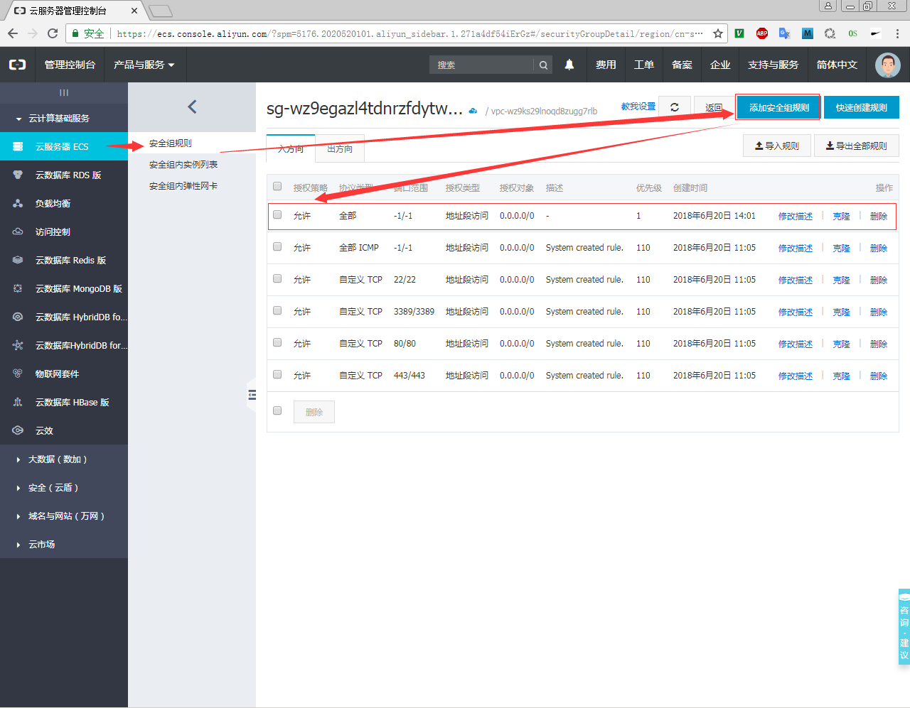
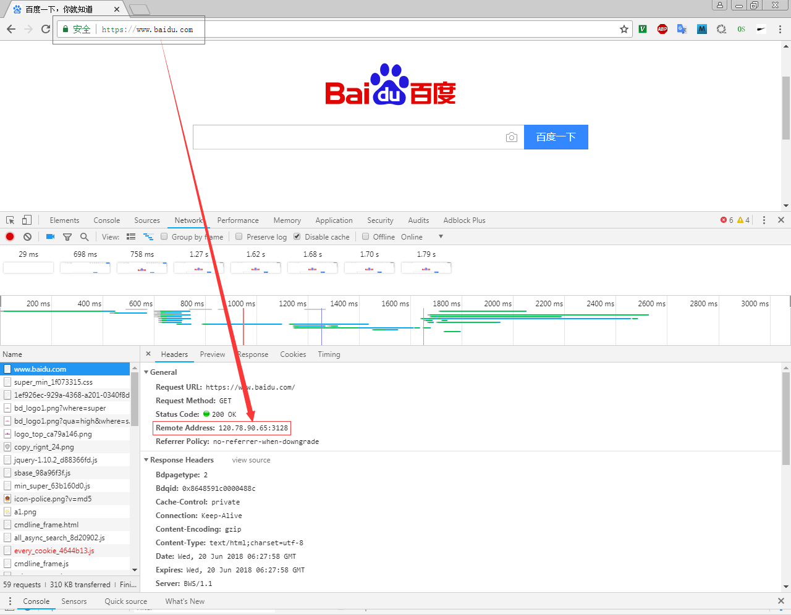

# Aliyun VPS Squid

## 参考文档

* [使用squid在阿里云服务器上搭建自己的代理服务器](https://blog.csdn.net/qq_21439971/article/details/54926553)
* [linux下配置squid http proxy过程](http://www.cnblogs.com/AloneSword/p/3430832.html)
* [使用squid搭建代理服务器](http://www.hawu.me/operation/852)

## 操作步骤

* 操作系统：Centos 6.8；
* `yum install squid`；
* 阿里云购买ECS（用于测试，购买了一个星期的，1核1G内存的ECS）；
* ECS访问端口权限设置，这里设置为接收所有的：  
  
* `cat /etc/squid/squid.conf`：
  ```
  #
  # Recommended minimum configuration:
  #
  acl manager proto cache_object
  acl localhost src 127.0.0.1/32 ::1
  acl to_localhost dst 127.0.0.0/8 0.0.0.0/32 ::1
  
  # Example rule allowing access from your local networks.
  # Adapt to list your (internal) IP networks from where browsing
  # should be allowed
  acl localnet src 10.0.0.0/8     # RFC1918 possible internal network
  acl localnet src 172.16.0.0/12  # RFC1918 possible internal network
  acl localnet src 192.168.0.0/16 # RFC1918 possible internal network
  acl localnet src fc00::/7       # RFC 4193 local private network range
  acl localnet src fe80::/10      # RFC 4291 link-local (directly plugged) machines
  
  acl SSL_ports port 443
  acl Safe_ports port 80          # http
  acl Safe_ports port 21          # ftp
  acl Safe_ports port 443         # https
  acl Safe_ports port 70          # gopher
  acl Safe_ports port 210         # wais
  acl Safe_ports port 1025-65535  # unregistered ports
  acl Safe_ports port 280         # http-mgmt
  acl Safe_ports port 488         # gss-http
  acl Safe_ports port 591         # filemaker
  acl Safe_ports port 777         # multiling http
  acl CONNECT method CONNECT
  
  #
  # Recommended minimum Access Permission configuration:
  #
  # Only allow cachemgr access from localhost
  http_access allow manager localhost
  http_access allow manager
  
  # Deny requests to certain unsafe ports
  # http_access deny !Safe_ports
  http_access allow !Safe_ports
  
  # Deny CONNECT to other than secure SSL ports
  # http_access deny CONNECT !SSL_ports
  http_access allow CONNECT !SSL_ports
  
  # We strongly recommend the following be uncommented to protect innocent
  # web applications running on the proxy server who think the only
  # one who can access services on "localhost" is a local user
  #http_access deny to_localhost
  
  #
  # INSERT YOUR OWN RULE(S) HERE TO ALLOW ACCESS FROM YOUR CLIENTS
  #
  
  # Example rule allowing access from your local networks.
  # Adapt localnet in the ACL section to list your (internal) IP networks
  # from where browsing should be allowed
  http_access allow localnet
  http_access allow localhost
  
  # And finally deny all other access to this proxy
  # http_access deny all
  http_access allow all
  
  # Squid normally listens to port 3128
  http_port 3128
  
  # Uncomment and adjust the following to add a disk cache directory.
  #cache_dir ufs /var/spool/squid 100 16 256
  
  # Leave coredumps in the first cache dir
  coredump_dir /var/spool/squid
  
  # Add any of your own refresh_pattern entries above these.
  refresh_pattern ^ftp:           1440    20%     10080
  refresh_pattern ^gopher:        1440    0%      1440
  refresh_pattern -i (/cgi-bin/|\?) 0     0%      0
  refresh_pattern .               0       20%     4320
  
  visible_hostname zengjf
  ```
* 打开防火墙：`iptables -I INPUT -p tcp --dport 3128 -j ACCEPT`；
* 初始化squid：`squid -z`；
* 开启squid：`squid`；
* 查看端口信息：`netstat -ntl`；
* 关闭squid： `squid -k shutdown`；
* 浏览器访问确认代理是否正常：
  
